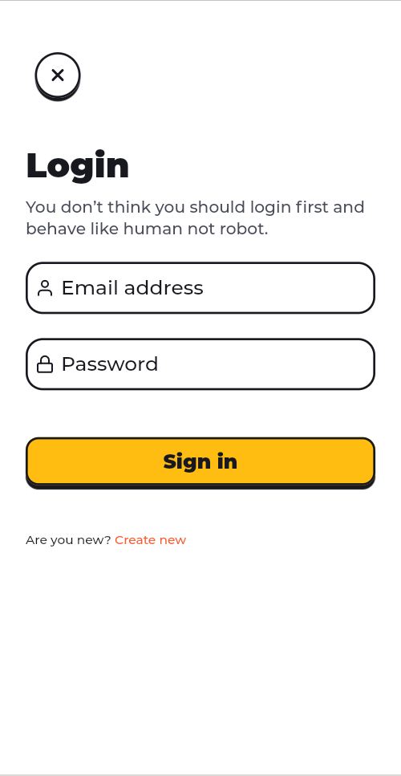

 Serdar Polat

 

 Contra Widgets

<h1>📱  Screens</h1>

<h2 style="text-align: center;">Splash</h2>

<h2 style="text-align: center;">Onboarding</h2>

<h2 style="text-align: center;">Sign In</h2>

<h2 style="text-align: center;">Sign Up</h2>

<h2 style="text-align: center;">Verify</h2>

<h2 style="text-align: center;">Contact Us</h2>

<h2 style="text-align: center;">Chat</h2>

